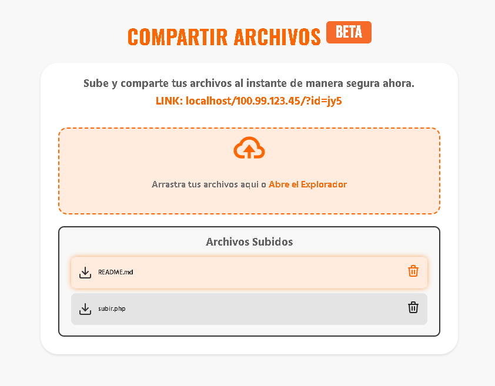

# InstaFile - Proyecto de Compartición de Archivos
La forma más rápida de compartir un archivo. Desde donde quieras hacia donde quieras.

**InstaFile** es una plataforma diseñada para facilitar la compartición de archivos de forma rápida y sencilla, desde cualquier lugar hacia cualquier destino. Este proyecto fue proporcionado por la empresa **Búho** con el objetivo de completar su desarrollo y mejorar su funcionalidad.

## Objetivo del Proyecto

El proyecto original no estaba completamente terminado, y nuestro equipo recibió las siguientes indicaciones para llevarlo a su fase final en una semana:

- **Cambiar el nombre del parámetro**: Modificar ciertos parámetros en el código para mayor claridad y funcionalidad.
- **Hacerlo 100% responsive**: Asegurarse de que la plataforma funcione de manera óptima en todos los dispositivos, desde móviles hasta pantallas de escritorio.
- **Reemplazar los espacios en blanco por guiones bajos (_)** en los nombres de los archivos al ser compartidos, para evitar problemas de compatibilidad.
- **Permitir la carga de múltiples archivos** de manera simultánea, mejorando la eficiencia para los usuarios.

Adicionalmente, se nos pidió **cambiar el diseño** del proyecto para mejorar la experiencia de usuario y cumplir con los estándares modernos.

## Proyecto Final - Screenshots

